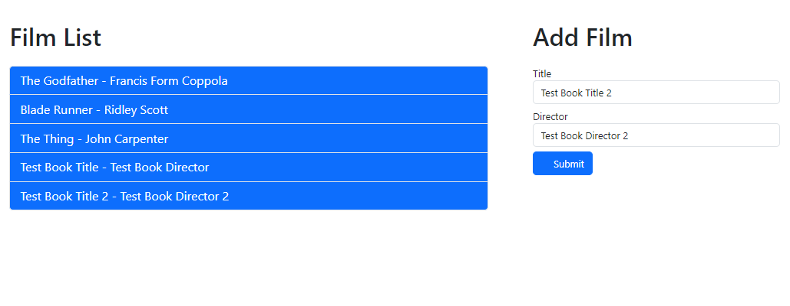

# GoTH-Stack-Studies
#### This repo contains results of courses / tutorials im doing on the GoTH stack

`Go` - `HTMX` - `Tailwind / Bootstrap` - `Template`

## Helpfull resources:

- Additional Resources:
    - [GO Templates](https://golangforall.com/en/post/templates.html)
    - [FULL Introduction To HTMX Using Golang](https://www.youtube.com/watch?v=x7v6SNIgJpE)
    - [A Light Introduction Into HTMX](https://theprimeagen.github.io/fem-htmx/)
    - [HTMX Book](https://hypermedia.systems/)
    - [HTMX Docks](https://htmx.org/docs/)
    - [GO Air](https://www.youtube.com/watch?v=erdDM_LmChs) - Live server reload for Go servers

- Links for tools / frameworks etc:
    - [Echo Framework](https://echo.labstack.com/) - Go backend framework
        - `go get github.com/labstack/echo/v4`
        
    - [Temple](https://github.com/a-h/templ) | [Temple Guide](https://templ.guide/)
        - `go install github.com/a-h/templ/cmd/templ@latest`
        - `go get github.com/a-h/templ`
# Applications
- ## [Movie List](./book_list/) - [source](https://www.youtube.com/watch?v=F9H6vYelYyU):

    #### This application was taking usage of `http`, `html/template` libraries from go, with `bootstrap5` and `HTMX`.
    the application is a simple demostration and binding of a Go and HTMX, creating a small booklist with adding functionality.

    

- ## [Template for a Go + Templ](./GOT/) - [source](https://www.youtube.com/watch?v=wttTTFVrQiw)
    #### This application is an example of a setup for a GO application, this uses `Temple`, `Make` and `Echo`
    It contains an example of structure for a project with good practices.

- ## [Reading List](./htmx-for-beginners/) - [source](https://www.youtube.com/watch?v=Yr-ubS0H7z4&list=PL4cUxeGkcC9gnEsXRqdY4e_xNy9GK7aQR)
    #### This application is an example of a setup for a GO application, this uses `express` & `HTMX`.
    this app contains CRUD methods using express.js & a search functionality.
    

- ## [HTMX Primer](./CRUD_application/) - [source](https://www.udemy.com/course/htmx-go-build-fullstack-applications-with-golang-and-htmx/)
